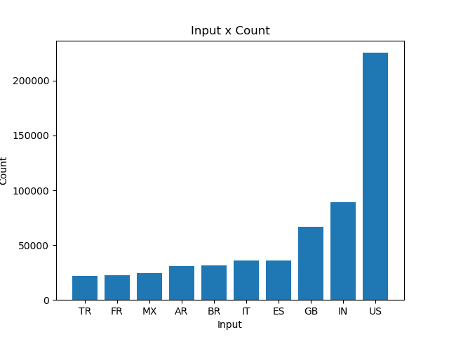
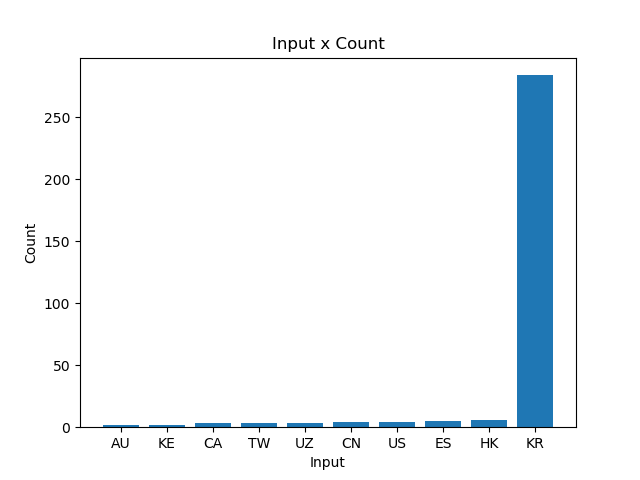

In this project, I combed through Twitter tweets in 2020 (specifically during the rise of COVID-19) and analyzed the usage of various hashtags. 

First, I started with the `map.py` file. I used this file to open a zip file for a days worth of tweets and track the popularity of certain hashtags. With my `map.py` file, I can assess the popularity of these hashtags on both the language and country level. 

If I wanted to see the hashtag usage on January 1st of 2020, I would enter the command

```
$ python3 ./src/map.py --input_path=/data/Twitter\ dataset/geoTwitter20-01-01.zip
```

If I wanted to view our results, I would have to go into the `outputs` folder and open the `/geoTwitter20-02-16.zip.lang` file for the hashtag popularity in certain languages. 

I then created the `run_maps.sh` shell file to loop over `map.py` so that I could have the hashtags usage results for everyday of the 2020 year. I ran this shell script in the background entering

```
$ nohup sh run_maps.sh &
```

into my terminal.

At this point, I had 730 files in my `outputs` folder: 365 language files and 265 country files. In order to reduce all of these into 2 files (`reduced_lang` and `reduced_country`), I used `reduce.py` by running

```
$ python3 ./src/reduce.py --input_paths outputs/geoTwitter20-*.lang --output_path=reduced.lang
$ python3 ./src/reduce.py --input_paths outputs/geoTwitter20-*.country --output_path=reduced.country
```

Using our two condensed reduce files, `reduced_lang` and `reduced_country`, I can now run `visualize.py` to turn my data into graphics. I then generated four different bar graphs which depended on 1) the `--input_path` which was either `reduced_lang` or `reduced_country` and 2) the `--key` (the two hashtag I decided to look into) which was either `#coronavirus` or `#코로나바이러스`. 

To see the use of #coronavirus by language, I ran

```
$ python3 ./src/visualize.py --input_path=reduced.lang --key='#coronavirus'
```

and got the graph


To see the use of #coronavirus by country, I ran

```
$ python3 ./src/visualize.py --input_path=reduced.country --key='#coronavirus'
```

and got the graph



To see the use of #코로나바이러스 by language, I ran

```
$ python3 ./src/visualize.py --input_path=reduced.lang --key='#코로나바이러스`
```

and got the graph


To see the use of #코로나바이러스 by country, I ran

```
$ python3 ./src/visualize.py --input_path=reduced.country --key='#코로나바이러스`
```

and got the graph



Finally, I use my `alternative_reduce.py` file to compare two different `--keys` and compares their usage throughout 2020. 

For example, if I wanted to compare the popularity of `#coronavirus` versus `#covid-19`, I would run

```
$ python3 ./src/alternative_reduce.py --keys '#coronavirus' '#corona' 
```

and get the graph


Using `alternative_reduce.py`, we can do this with other combinations of hashtags, like `#doctor` and `#nurse`, by using the command

```
$ python3 ./src/alternative_reduce.py --keys '#doctor' '#nurse'
```

and get


